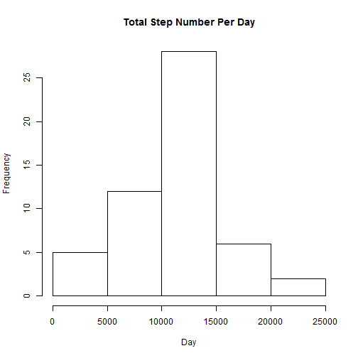
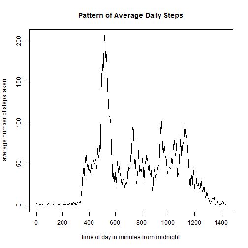
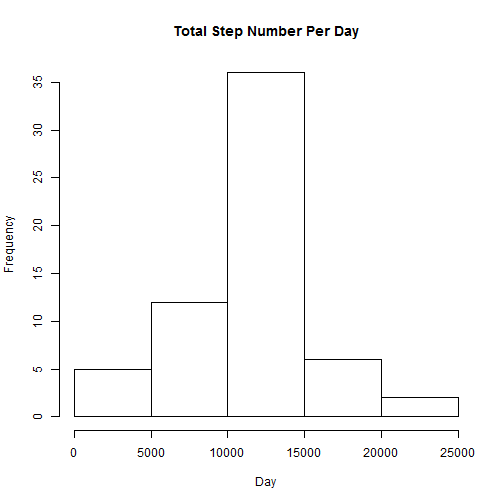

Load knitr, plyr, and dplyr packages. Set global options to echo=TRUE.

```r
library(knitr)
library(plyr)
library(dplyr)
opts_chunk$set(echo = TRUE)
```

## Loading and preprocessing the data

Read in the data.

```r
data <- read.csv(unzip("activity.zip"))
```

Get subset of data where there are no missing values.

```r
complete <- data[complete.cases(data),]
```

## What is mean total number of steps taken per day?

1. Use "complete", which is the subset of data without missing values. For each day, calculate the total number of steps taken. To do this, group by date, then summarize the sums of steps.

```r
groupedByDate <- group_by(complete, date)
stepsPerDay <- summarise_each(groupedByDate, funs(sum), steps)
```

2. Make a histogram of the total step number per day.

```r
hist(stepsPerDay$steps, main = "Total Step Number Per Day", xlab="Day")
```

 

3. Calculate the mean and median for the total step number per day.

```r
mean = format(round(mean(stepsPerDay$steps), 0), nsmall=0)
median = median(stepsPerDay$steps)
```
The mean step number per day is 10766 steps. The median for the step number per day is 10765 steps.

## What is the average daily activity pattern?

1. Use "complete", which is the subset of data without missing values. For each 5-minute interval, calculate the total number of steps taken. To do this, group by 5-minute interval, then summarize the means of the number of steps. Replace the interval identifiers by a regular sequence with a step of 5 to represent minutes from midnight. Then make a plot of the step number means over the 5-minute intervals.


```r
groupedByInterval<- group_by(complete, interval)
MeanStepsPerInterval <- summarise_each(groupedByInterval, funs(mean), steps)
MeanStepsPerInterval$interval <- seq(0,1435,5)
plot(MeanStepsPerInterval$interval, MeanStepsPerInterval$steps, type="l", xlab="time of day in minutes from midnight", ylab = "average number of steps taken", main = "Pattern of Average Daily Steps")
```

 

Determine the 5-minute interval that contains the maximum average number of steps.

```r
maxInterval <- MeanStepsPerInterval[MeanStepsPerInterval$steps==max(MeanStepsPerInterval$steps), 1]
```
The 5-minute interval that contains the maximum average number of steps is at 515 minutes from midnight.

## Imputing missing values

1. Calculate the total number of rows with missing values (coded as "NA")

```r
nrowsincomplete <- nrow(data) - nrow(complete)
```
The total number of rows with missing values is 2304.

2. Strategy for filling in the missing values: replace the missing step value with the average number of steps for that 5-minute interval.

3. Create data set with missing values filled in according to the above strategy.

```r
groupedByInterval<- group_by(complete, interval)
MeanStepsPerInterval <- summarise_each(groupedByInterval, funs(mean), steps)

for(i in seq(1,nrow(data))) {
  if(is.na(data$steps[i])) {
    #determine interval
    intervalForMissing <- data$interval[i]
    #replace NA with average number of steps for the interval
    data$steps[i] <- MeanStepsPerInterval[MeanStepsPerInterval$interval==
                                            intervalForMissing,2]
  }
}
```

4. Make a histogram of the total step number per day.

```r
data$steps <- as.numeric(as.character(data$steps))
dataGroupedByDate <- group_by(data, date)
dataStepsPerDay <- summarise_each(dataGroupedByDate, funs(sum), steps)
hist(dataStepsPerDay$steps, main = "Total Step Number Per Day", xlab="Day")
```

 

Calculate the mean and median for the total step number per day.

```r
meanFilled = format(round(mean(dataStepsPerDay$steps), 0), nsmall=0)
medianFilled = format(round(median(dataStepsPerDay$steps), 0), nsmall=0)
```
For the filled-in data, the mean step number per day is 10766 steps and the median for the step number per day is 10766 steps. The means for the filled-in data and non-filled-in data are identical and the medians differ by only 1 step. Thus, imputing missing data did not have much impact on the estimates of the total step number per day.

## Are there differences in activity patterns between weekdays and weekends?
